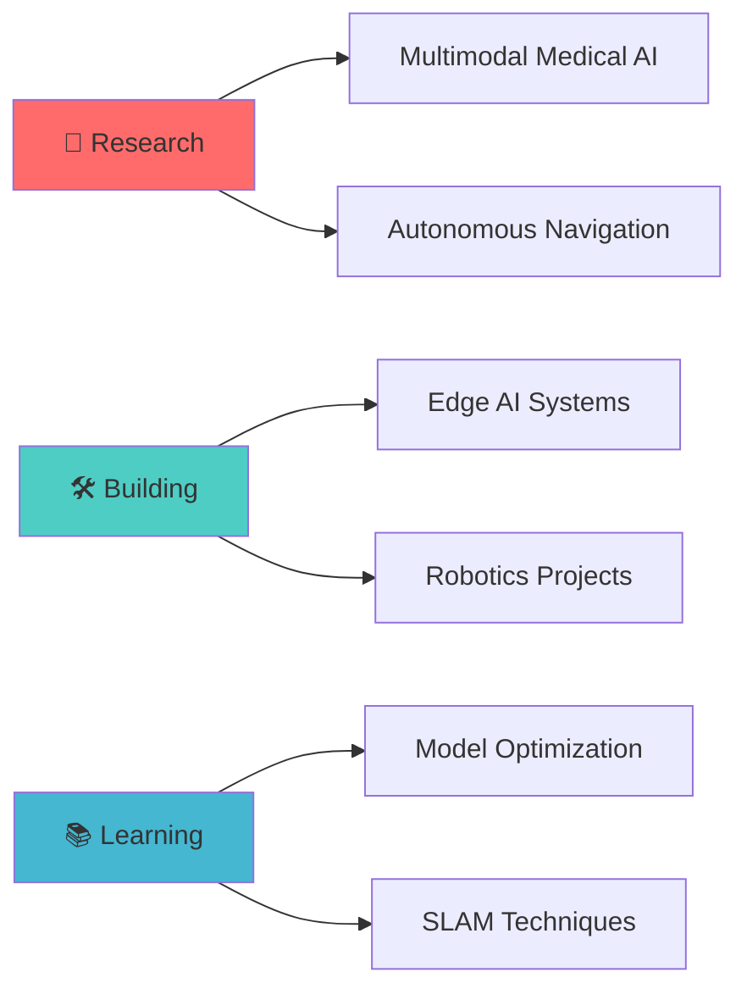

# 🤖 Aman Raut | AI Engineer & Robotics Enthusiast

<div align="center">

```ascii
    ___
   /   \     Building Intelligence,
  | O O |    One Algorithm at a Time
   \   /     
   /| |\     M.Sc. Artificial Intelligence
  /_|_|_\    Brandenburg University of Technology
```

[](https://badassaman4014.github.io/Portfolio-Website/)
[](https://www.linkedin.com/in/aman-raut-663484246/)
[](mailto:amanraut8263@gmail.com)

</div>

---

## 🧠 About Me

```python
class AmanRaut:
    def __init__(self):
        self.location = "Cottbus, Germany 🇩🇪"
        self.education = "M.Sc. Artificial Intelligence"
        self.interests = [
            "Deep Learning 🧠",
            "Computer Vision 👁️",
            "Autonomous Robotics 🤖",
            "IoT Systems 📡"
        ]
        self.current_focus = "Multimodal Deep Learning for Medical AI"
        
    def say_hi(self):
        print("Thanks for dropping by! Let's build something amazing together 🚀")

me = AmanRaut()
me.say_hi()
```

---

## 🔧 Technology Arsenal

<table>
<tr>
<td width="50%" valign="top">

### 🎯 Core Competencies
```yaml
Programming:
  Expert: Python, C++
  Proficient: SQL, JavaScript
  
Deep Learning:
  Frameworks: PyTorch, TensorFlow, Keras
  Libraries: OpenCV, Scikit-Learn, Pandas
  Specialties: 
    - Computer Vision
    - Model Optimization
    - Transfer Learning
```

</td>
<td width="50%" valign="top">

### 🤖 Robotics & Embedded
```yaml
Robotics:
  - ROS/ROS2 Navigation
  - SLAM & Path Planning
  - Sensor Fusion
  
Hardware:
  - ESP32/ESP8266
  - Arduino Ecosystem
  - Raspberry Pi
  - NVIDIA Jetson
```

</td>
</tr>
</table>

---

## 🎨 Tech Stack Visualization

<div align="center">

### 💻 Languages & Frameworks


### 🧠 AI/ML Stack


### 🤖 Robotics & IoT


### ⚙️ Tools & DevOps


</div>

---

## 🚀 What I'm Up To



<table>
<tr>
<td width="33%">
<div align="center">

### 🔭 Current Projects
Multimodal deep learning systems for medical diagnostics

</div>
</td>
<td width="33%">
<div align="center">

### 🌱 Learning
Advanced SLAM & edge deployment techniques

</div>
</td>
<td width="33%">
<div align="center">

### 🤝 Collaborating
Open to robotics & computer vision projects

</div>
</td>
</tr>
</table>

---

## 💼 Experience Highlights

<details>
<summary><b>🏢 Click to expand my journey</b></summary>

<br>

**🎓 Research & Academia**
- Deep learning model development for real-world applications
- Computer vision systems for industrial automation
- Autonomous navigation and robotics research

**💻 Technical Projects**
- IoT systems with ESP32/Arduino integration
- ROS-based autonomous navigation systems
- Production-ready ML pipeline development

**🛠️ Skills Developed**
- End-to-end ML pipeline deployment
- Embedded systems programming
- Cross-platform software development

</details>

---

## 🎯 Featured Projects Showcase

<div align="center">

| Project | Description | Tech Stack |
|---------|-------------|------------|
| 🏥 **Medical AI System** | Multimodal deep learning for diagnostics | PyTorch, OpenCV, Flask |
| 🤖 **Autonomous Robot** | ROS-based navigation with SLAM | ROS2, Python, C++ |
| 📡 **IoT Dashboard** | Real-time sensor monitoring system | ESP32, Firebase, React |
| 👁️ **Vision System** | Object detection & tracking pipeline | YOLOv8, TensorFlow, OpenCV |

</div>

---

## 📊 GitHub Activity

<div align="center">


</div>

---

## 🌟 Areas of Expertise

<div align="center">

| 🧠 AI/ML | 🤖 Robotics | 💻 Engineering |
|----------|-------------|----------------|
| Deep Learning | ROS Navigation | System Design |
| Computer Vision | SLAM | IoT Architecture |
| Model Optimization | Path Planning | Embedded Systems |
| Transfer Learning | Sensor Fusion | Edge Deployment |

</div>

---

## 📫 Let's Connect & Collaborate!

<div align="center">

I'm always excited to discuss AI, robotics, and innovative ideas. Whether you want to collaborate on a project, discuss research, or just chat about technology—I'd love to hear from you!

### 📬 Reach Out

<a href="mailto:amanraut8263@gmail.com">
  
</a>
<a href="https://www.linkedin.com/in/aman-raut-663484246/">
  
</a>
<a href="https://badassaman4014.github.io/Portfolio-Website/">
  
</a>

</div>

---

<div align="center">

### 💭 Philosophy

```
"The best way to predict the future is to invent it."
                                        - Alan Kay
```

**Building intelligent systems that bridge the gap between**  
**hardware and software, one algorithm at a time** 🚀

---


*Thanks for visiting! Feel free to explore my repositories and don't hesitate to reach out!* ⭐

</div>
